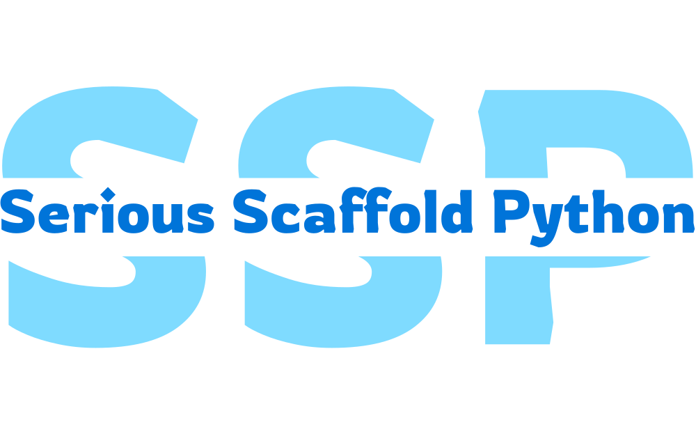

# Serious Scaffold Python

A development-focused Python project template with various integrations, configurations and modules.

[](https://github.com/serious-scaffold/serious-scaffold-python/actions/workflows/ci.yml)
[](https://codecov.io/gh/serious-scaffold/serious-scaffold-python)
[](https://serious-scaffold-python.readthedocs.io/)
[](https://github.com/serious-scaffold/serious-scaffold-python/blob/main/LICENSE)
[](https://pypi.org/project/serious-scaffold/)
[](https://pypi.org/project/serious-scaffold/)

[](https://github.com/psf/black)
[](https://pycqa.github.io/isort/)
[](http://mypy-lang.org/)
[](https://github.com/astral-sh/ruff)
[](https://pydantic.dev)
[](https://github.com/serious-scaffold/serious-scaffold-python)

[](https://github.com/serious-scaffold/serious-scaffold-python)

Setting up a project often involves more than just establishing a basic project structure. It involves tasks like integrating GitHub Actions or GitLab CI/CD, configuring linters, tests and documentation, as well as implementing settings, logging and other frequently used modules. [Serious Scaffold Python](https://github.com/serious-scaffold/serious-scaffold-python) streamlines this process. Powered by [`copier`](https://copier.readthedocs.io/), bootstrapping a new Python project can be done with a single command. By answering a few questions, the project will be fully configured and ready for development. Furthermore, the project can be updated alongside the advancement of the template.

If you find this helpful, please consider [sponsorship](https://github.com/sponsors/huxuan).

## :hammer_and_wrench: Features

- **Template Rendering**
  - Leverage [`copier`](https://copier.readthedocs.io/) for project initiation and  template updates.
- **Environment Management**
  - Manage [virtual environment](https://docs.python.org/3/glossary.html#term-virtual-environment) with [`pipenv`](https://pipenv.pypa.io/) for daily development.
  - Run CI/CD in containers with different Python versions to ensure compatibility.
- **Dependency Management**
  - Categorize dependencies by purpose, allowing for selective installation.
  - Use [constraints](https://pip.pypa.io/en/stable/user_guide/#constraints-files) to pin dependencies on different environments to ensure reproducibility.
- **Code Quality**
  - Incorporate linters such as [`black`](https://github.com/psf/black), [`isort`](https://pycqa.github.io/isort/), [`mypy`](http://www.mypy-lang.org/), [`ruff`](https://github.com/charliermarsh/ruff), and [`toml-sort`](https://github.com/pappasam/toml-sort).
  - Integrate [`pre-commit`](https://pre-commit.com/) with [built-in hooks](https://github.com/pre-commit/pre-commit-hooks) and [local](https://pre-commit.com/#repository-local-hooks) linters for Git hooks automation.
- **Tests**
  - Leverage [`pytest`](https://pytest.org/) for tests, supplemented by [`coverage`](https://coverage.readthedocs.io) reports and thresholds.
- **Package**
  - Utilize [`setuptools-scm`](https://github.com/pypa/setuptools_scm/) for versioning using git metadata.
- **Documentation**
  - Leverage [`sphinx`](https://www.sphinx-doc.org/) with the [`furo`](https://pradyunsg.me/furo) theme, incorporating [MyPy](https://mypy.readthedocs.io/en/stable/command_line.html?report-generation) and [Coverage](https://coverage.readthedocs.io/en/7.3.0/cmd.html#html-reporting-coverage-html) reports.
  - Support integration with [Read the Docs](https://readthedocs.org/).
- **Continuous Integration**
  - Provide pre-configured [GitHub Actions](https://docs.github.com/actions) and [GitLab CI/CD](https://docs.gitlab.com/ee/ci/) for features above.
- **Common Modules**
  - Utilize [`typer`](https://typer.tiangolo.com/) for Command Line Interface development.
  - Utilize [`pydantic-settings`](https://docs.pydantic.dev/latest/usage/pydantic_settings/) for settings management.
- **Miscellaneous**
  - Offer a unified `Makefile` as the entry point for common actions.
  - Provide VSCode [settings](.vscode/settings.json) with recommended [extensions](.vscode/extensions.json).

## :wrench: Prerequisites

Certain system-level Python applications are needed and it is recommended to use [`pipx`](https://pypa.github.io/pipx/) to install and run them in isolated environments. Refer to pipx's installation instructions [here](https://pypa.github.io/pipx/installation/). Once `pipx` is set up, install the necessary tools using the following commands.

```bash
# Copier: Template rendering for projects.
pipx install copier

# Pipenv: Virtual environment and package manager for Python.
pipx install pipenv

# Pre-commit: Automates Git hooks for code quality checks.
pipx install pre-commit
```

## :rocket: Quickstart

1. Generate the project.

   ```bash
   copier copy gh:serious-scaffold/serious-scaffold-python /path/to/project
   ```

1. Navigate to the project directory and initialize a git repository.

   ```bash
   cd /path/to/project
   git init
   ```

1. Set up the development environment.

   ```bash
   make dev
   ```

1. Commit the initialized project.

   ```bash
   git add .
   git commit -m "Initialize from serious-scaffold-python."
   ```

1. That's it! Focus on the coding mostly within `src` folder now.

## :scroll: License

MIT, for more details, check out the [LICENSE](LICENSE) file.
